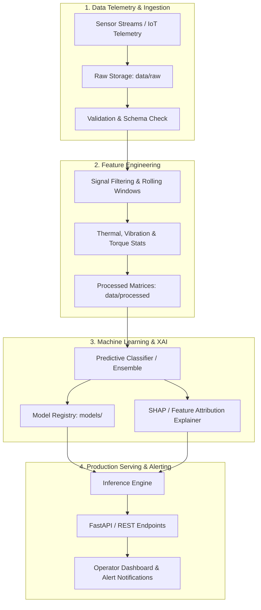

# MachSense System Architecture

MachSense is an industrial-grade predictive maintenance and machine health monitoring system. It processes continuous time-series telemetry from machine sensors, detects early anomalies, forecasts component failures, and provides explainable diagnostic attribution for plant operators.

## Layer Descriptions

1. **Telemetry & Ingestion (`machsense.data`)**:
   - Ingests multi-variate continuous telemetry (temperature, rotational speed, torque, tool wear).
   - Validates data types, missing values, and sensor drift.

2. **Feature Engineering (`machsense.features`)**:
   - Extracts domain-specific engineering features (e.g., power dissipation, thermal resistance, mechanical strain).
   - Applies robust scaling and temporal sliding-window aggregations.

3. **Predictive Modeling & Explainability (`machsense.models`)**:
   - Trains state-of-the-art tree-based ensembles (LightGBM/XGBoost/RandomForest) and temporal architectures.
   - Computes real-time SHAP values so maintenance engineers know *why* an alert fired.

4. **Configuration & Governance (`machsense.config` & `machsense.utils`)**:
   - Centralized YAML-based settings with Pydantic type validation and environment overrides.
   - Standardized structured logging with rotating file handlers.
